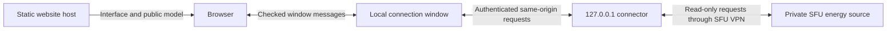

# Local live-data connector

The same static frontend can be served locally or from GitHub Pages. Its browser sends private requests to a connector on the same computer, which uses that computer’s SFU network/VPN access. GitHub does not need a VPN and does not process the readings.



## Start and pair

1. Connect this computer to the SFU network or VPN.
2. Run `pnpm start:twin`, or `sh scripts/start-local.sh` when using the bundled runtime on this computer.
3. Open `http://127.0.0.1:4173/SFU-DigitalTwin/` and choose **Connect live data**.
4. Open the local connector page at `http://127.0.0.1:8787/`. Copy its temporary pairing code and paste it into the viewer.
5. Choose **Pair this tab**. This opens a small local connection window. Once it says **Paired**, minimize it and return to the campus viewer. Keep the window open and select a building with a configured private meter mapping.

Each pairing code expires after 10 minutes and works once. **New code** on the local connector page generates a replacement. Sessions expire after eight hours, clear from the browser on reload and can be revoked with **Disconnect live data**. Restarting the connector ends all sessions. No token is saved in browser storage or sent in a URL.

## Private configuration

The working configuration is already in `.private/foreseer.json`. It contains the upstream `baseUrl` and a `meters` array of `{buildingCode, channelId, device}` entries. Keep this file and the supplied legacy energy files private. They are not copied into the static build or the hosted app.

Optional `.private/connector.json` can replace the viewer origin allowlist:

```json
{
  "allowedOrigins": [
    "https://makonin.com",
    "https://smakonin.github.io",
    "http://127.0.0.1:4173"
  ]
}
```

An origin includes the scheme, hostname and port, with no path or trailing slash. GitHub Pages project paths share the account’s origin. Pair only the intended viewer; origin checking is combined with a random session token. Configuration changes require restarting the connector.

The default list permits the intended GitHub Pages origin, its existing `https://makonin.com` custom domain, and loopback development/preview origins on ports 3000 and 4173. Additional remote origins must use HTTPS. The connector itself always binds to `127.0.0.1:8787`; it does not listen on LAN or VPN interfaces.

## Browser behavior

Safari blocks an HTTPS page from directly fetching an HTTP loopback API. The viewer therefore opens a top-level local window using a user-initiated button. That window makes same-origin connector requests and passes results back through `postMessage`. Both sides check the sender origin, the exact peer window and a per-connection random nonce. The bearer token stays in the local window’s memory; the hosted viewer receives readings and session expiry, not the bearer token. Messages always use an exact target origin, never `*`.

The static page’s Content Security Policy permits fetches only to its own origin. No mixed-content settings or browser protections are disabled. The direct CORS API remains available to compatible clients; it is not the default browser transport.

Connecting a VPN supplies network reachability; it does not override browser rules. See [MDN CORS](https://developer.mozilla.org/en-US/docs/Web/HTTP/Guides/CORS), [local network access](https://developer.mozilla.org/en-US/docs/Web/Security/Defenses/Local_network_access) and [window messaging](https://developer.mozilla.org/en-US/docs/Web/API/Window/postMessage).

If pairing fails:

- **Cannot reach connector:** confirm the connector is running on this same computer.
- **Connection window blocked:** allow the window to open for this viewer, then choose Pair this tab again.
- **Connection window closed:** pair again and keep the new window open; minimizing it is fine.
- **Website not allowed:** add the exact viewer origin to the private allowlist and restart the connector.
- **Invalid or expired code:** open the local connector page and generate a new code.
- **SFU source unreachable:** check the VPN and the source service. Pairing with the local connector does not prove the upstream source is reachable.
- **No meter mapping:** the selected public building code has no private mapping. No values are invented.

## API and privacy controls

- `POST /v1/session` exchanges a one-use pairing code for an origin-bound token.
- `GET /v1/energy?code=004` reads that building’s configured private meters with `Authorization: Bearer …`.
- `DELETE /v1/session` revokes the current session.
- The pairing management page is available only through direct loopback navigation. It denies embedding and does not enable CORS.
- Host validation protects against requests addressed to other hostnames. Cross-origin data requests require an explicitly allowed Origin and matching token. Local-window requests require the loopback origin (or same-origin Fetch Metadata for GET) and its matching token. Preflights permit only the expected methods and headers.
- Client requests cannot choose upstream addresses, channel IDs or write commands. Responses use `Cache-Control: no-store`; connector logs contain no private source configuration, tokens or readings.
- Recent reads are cached in connector memory for 60 seconds. The UI keeps up to 60 observations in memory per selected meter. There is no operational database, telemetry upload or history export.
- Demand remains individual meter readings. Electrical coverage and hierarchy are unverified, so the app does not calculate building or campus totals. Source sample timestamps are unavailable and remain explicitly marked as such.

## Verification record — September 6, 2026

Automated tests cover pairing reuse/expiry, session origin binding and expiry, disconnection during a pending read, missing authentication, unapproved origins, Host validation, allowed preflight headers, read caching, forbidden upstream parameters, pairing rate limits and source failure handling, relay message spoofing and bearer-token isolation.

The initial static build was tested in the Codex in-app browser on loopback: invalid pairing was rejected; valid pairing displayed live Library and Blusson Hall readings over SFU VPN; changing to an unmapped building removed prior readings and displayed an explicit missing-mapping message. Automatic polling produced changing values and session charts. Disconnecting removed the readings, and reloading returned to the unpaired state. The official logo and 3D model rendered correctly.

Safari’s console confirmed direct HTTPS-to-HTTP fetches were blocked as mixed content. The revised local-window transport passed in Safari locally, including pairing, live reads, continued polling and disconnect. It then passed from **https://makonin.com/SFU-DigitalTwin/**: the local window paired to `https://makonin.com` and the hosted viewer displayed live Library readings through the SFU VPN. GitHub Pages enforces HTTPS. The original direct-fetch approach timed out in the Codex in-app browser and is no longer the default transport. Other browsers have not been verified for the revised flow.

The public-artifact check scans the static assets and GLB/JSON metadata for operational fields and known private source values. Existing private Git history is outside this check and must be replaced with a reviewed clean history before any public source push.
